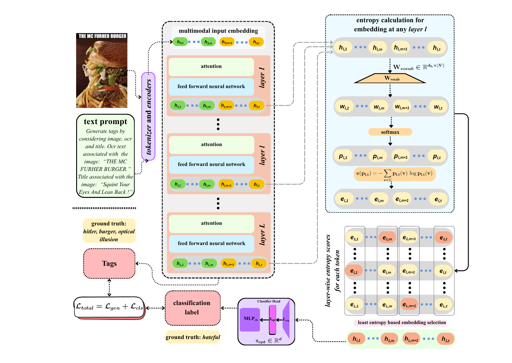

<!-- # STEMTOX -->

## STEMTOX: From Collaborative Tags to Fine-Grained Toxic Meme Detection via Entropy-Guided Multi-Task Learning

🎉 **Accepted at Transactions of the Association for Computational Linguistics (TACL 2026).**

**Authors:**  
Subhankar Swain*, Naquee Rizwan*, Vishwa Gangadhar S, Nayandeep Deb, Animesh Mukherjee

(*) denotes equal contribution

---

# 📦 TOXICTAGS Dataset

> **Download the TOXICTAGS dataset:**  
> 🤗 **https://huggingface.co/datasets/swainsubhankar/ToxicTags**

---
<!-- - 📑 Paper -->
- 📖 arXiv(https://arxiv.org/abs/2508.04166)
<!-- - 💻 Code -->
<!-- - 📊 Slides -->

<!-- *(Links will be updated upon public release.)* -->

---
> [!WARNING]
> This repository and the associated dataset contain examples of potentially toxic and offensive content for research purposes.

## STEMTOX Architecture

<p align="center">
  
</p>

## 📖 Abstract

Memes, as a widely used mode of online communication, often serve as vehicles for spreading harmful content. However, limitations in data accessibility and the high costs of dataset curation hinder the development of robust meme moderation systems. To address this challenge, we introduce **TOXICTAGS**, a first-of-its-kind dataset consisting of **6,300 real-world meme-based posts** annotated through a two-stage process: (i) binary classification into **toxic** and **normal**, and (ii) fine-grained labeling of toxic memes as **hateful**, **dangerous**, or **offensive**. A key feature of TOXICTAGS is its enrichment with auxiliary metadata in the form of **socially relevant tags**, providing valuable contextual information for each meme. Building on this dataset, we propose **STEMTOX**, a novel **entropy-guided multi-task learning framework** that jointly generates socially grounded tags and performs robust toxicity classification. Experimental results demonstrate that incorporating these contextual tags substantially improves the performance of state-of-the-art Vision-Language Models (VLMs) on toxicity detection tasks. Our contributions provide a novel and scalable foundation for improved multimodal content moderation in online environments.

## ✨ Key Contributions

**(A)** We introduce **TOXICTAGS**, a diverse real-world meme dataset that incorporates **collaborative tags** collected from associated post metadata—a critical yet often overlooked feature in social media content that is extensively used for describing, categorizing, and commenting on digital content. Unlike prior datasets, it consists of **only real-world memes** with no restrictions based on specific targets or events. The final dataset comprises **6,300** annotated memes, capturing a wide spectrum of online discourse.

**(B)** We design a rigorous **two-stage human annotation pipeline**. In the first stage, memes are annotated as either **toxic** or **normal**. In the second stage, toxic memes are further categorized into one of three fine-grained classes: **hateful**, **dangerous**, or **offensive**. These categories were distilled through an iterative annotation process, resulting in a four-class taxonomy that is expressive for moderating a wide range of social media content.

**(C)** We introduce **STEMTOX**, a novel entropy-guided multi-task learning framework that jointly generates **socially grounded collaborative tags** and performs **fine-grained toxicity classification**, significantly improving meme classification performance over existing approaches.
## 📚 Citation

If you find our work useful in your research, please consider citing:

```bibtex
@misc{swain2026stemtoxsocialtagsfinegrained,
  title={STEMTOX: From Social Tags to Fine-Grained Toxic Meme Detection via Entropy-Guided Multi-Task Learning},
  author={Subhankar Swain and Naquee Rizwan and Vishwa Gangadhar S and Nayandeep Deb and Animesh Mukherjee},
  year={2026},
  eprint={2508.04166},
  archivePrefix={arXiv},
  primaryClass={cs.CV},
  url={https://arxiv.org/abs/2508.04166}
}
```

## 📧 Contact

For any questions, suggestions, or issues regarding this repository, please contact:

**subhankar.swain25@kgpian.iitkgp.ac.in**, **naqueerizwan1998@gmail.com**
